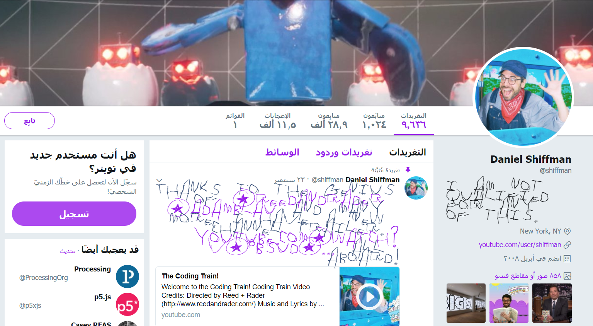

Twitter-Scribbler
is a chrome extension that change the font of tweets to a font similar to a child scribble

Disclaimer:
This extension uses the font "tommy’s first alphabet" by [Divide By Zero](https://www.dafont.com/divide-by-zero.d14) http://fonts.tom7.com/

</img>
[daniel shiffman](https://twitter.com/shiffman)

